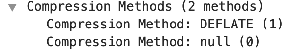

Noemi Glaeser  
CMSC 818O: Security (Fall 2019)  
Presented: 1 Oct 2019  

# CRIME Attack Demo  

## To do

will add the following to a binaries folder: Ubuntu ISO, Chrome ZIP, nginx-1.\*.6.tar.gz, openssl-0.9.\*.tar.gz

**Current issue:** despite OpenSSL compiled with `DZLIB`, Server Hello still offers no compression methods.  
Right now, I see these options:  
- try with nginx 1.1.6 instead, or newer
- Watch [Rizzo & Duong demo](https://www.youtube.com/watch?v=BysvLotMrwY&index=13&list=PLaIv9WEAzYZPWxpP3fNyEW77EnCFt1vzl)

## Dependencies

Installation of these dependencies is described in the [Set Up](#set-up) section; all source files/binaries are available in the [binaries folder](./binaries).

* **Python 3**
* **nginx:** for example [nginx 1.0.6]() (or [1.1.6]()?)
* **an outdated version of OpenSSL:** [openssl-0.9.8zb]() and [openssl-0.9.7]()
* **a browser with SSL compression:** [Chrome 15.0.0875.0]()
* **a Linux virtual machine to run everything in:** for example [Ubuntu 14.04 LTS]()

A VM image is available with all of this configuration already done ([here]()). If you choose to go that route, skip to [this section]().

## Set Up

### 1. Ubuntu Virtual Machine

* [Install VirtualBox](https://www.virtualbox.org/wiki/Downloads) or VMWare, depending on your host system. *(Note: On MacOS 10.14, I had to jump through some hoops to get VirtualBox installed; see [this thread](https://forums.virtualbox.org/viewtopic.php?f=8&t=84092))*

* Create an Ubuntu VM and load an Ubuntu 14.04 ISO into it, as described in [this article](https://www.cs.unm.edu/~bradykey/ubuntuVMInstallGuide.html), for example. (Other versions of Ubuntu may work too, but this is the one I used.)
    * Be sure to set the Network Adapter to NAT (Settings > Network > Attached to: NAT).
    * Set enough memory, provided your host machine can afford it, so the VM won't lag painfully. I set it at 4096 MB. 
    * All subsequent instructions in this readme should be done on the VM.

### 2. Vulnerable Browser

Install the vulnerable browser on your VM. It seems only Chrome (or Chromium) was every truly vulnerable to CRIME, so in this demo I used [Chromium 15.0.875.0](https://www.googleapis.com/download/storage/v1/b/chromium-browser-snapshots/o/Linux_x64%2F100002%2Fchrome-linux.zip?generation=1&alt=media).

```
wget https://www.googleapis.com/download/storage/v1/b/chromium-browser-snapshots/o/Linux_x64%2F100002%2Fchrome-linux.zip?generation=1&alt=media
unzip Linux_x64_100002_chrome-linux.zip
cd chrome-linux
./chrome-wrapper
```

### 3. OpenSSL

Install OpenSSL with zlib support as described [here](https://securitygrind.com/building-openssl-with-zlib-support/). Summary below:  

```
# uninstall any existing OpenSSL
apt-get remove openssl
apt-get purge openssl

# download the zlib library
apt-get install zlib1g-dev

# install openssl
cd Downloads
wget https://www.openssl.org/source/old/0.9.x/openssl-0.9.8zb.tar.gz
tar xvf openssl-0.9.8zb.tar.gz
cd openssl-0.9.8zb
./config zlib
make
sudo make install

# double check version and zlib capabilities
~/Downloads/openssl-1.0.2t/apps/openssl version -a
```

Output from last command should look something like this (note the `DZLIB` compiler flag):  

```
OpenSSL 0.9.8zb 6 Aug 2014
built on: Fri Sep 27 01:59:42 EDT 2019
platform: linux-x86_64
options:  bn(64,64) md2(int) rc4(1x,char) des(idx,cisc,16,int) idea(int) blowfish(idx) 
compiler: gcc -DZLIB -DOPENSSL_THREADS -D_REENTRANT -DDSO_DLFCN -DHAVE_DLFCN_H -Wa,--noexecstack -m64 -DL_ENDIAN -DTERMIO -O3 -Wall -DMD32_REG_T=int -DOPENSSL_BN_ASM_MONT -DSHA1_ASM -DSHA256_ASM -DSHA512_ASM -DMD5_ASM -DAES_ASM
OPENSSLDIR: "/usr/local/ssl"
```

### 4. nginx

Install an nginx version that supports SSL compression, such as [nginx 1.0.6](http://nginx.org/download/). 

See [this article](https://www.thegeekstuff.com/2011/07/install-nginx-from-source/) about installing nginx from source. Here are the commands and options I used (use `sudo` as necessary):  

```
sudo ./configure --with-http_ssl_module --without-http_rewrite_module --with-ld-opt="-L /home/noemi/Downloads/openssl-0.9.8zb -lssl -lcrypto -lz -ldl -static-libgcc" # this compiles nginx properly! and openssl version -a still has the DZLIB flag! But the Server Hello packet still has no compression methods
sudo ./configure --with-http_ssl_module --without-http_rewrite_module --with-ld-opt="-L /home/noemi/Downloads/openssl-0.9.8zb -Wl,-rpath,/home/noemi/Downloads/openssl-0.9.8zb -lssl -lcrypto -lz -ldl -static-libgcc" 
# check that the correct libraries were linked
ldd /usr/local/nginx/sbin/nginx
# still doesn't have the right library dir

# also tried
export LD_LIBRARY_PATH="/path/to/Downloads/openssl-0.9.8zb

sudo make
sudo make install

# Alias so we don't need to type the full path every time
alias nginx=/usr/local/nginx/sbin/nginx

# Make a backup of the original config file; we will modify it in the next section
cp /usr/local/nginx/conf/nginx.conf /usr/local/nginx/conf/nginx.conf-bak
```

### 4. Python

Alternative to nginx: trying python instead. 

```
python --version
Python 2.7.10
```

```
python
>>> import BaseHTTPServer, SimpleHTTPServer
>>> import ssl
>>> httpd = BaseHTTPServer.HTTPServer(('localhost', 4443), SimpleHTTPServer.SimpleHTTPRequestHandler)
>>> httpd.socket = ssl.wrap_socket (httpd.socket, certfile='/Users/noemi/Documents/UMD/fall19/CMSC818O-Security/attack/cert.pem', keyfile='/Users/noemi/Documents/UMD/fall19/CMSC818O-Security/attack/key.pem', server_side=True)
>>> httpd.serve_forever()
```

### 5. Setting up the mock sites

On the VM, serve the contents of the faceb00k and cookies sites as follows.

1. Add the following localhost aliases to `/etc/hosts` (you may need to `sudo` edit):

```
127.0.0.1   localhost
127.0.0.1   faceb00k.com
127.0.0.1   www.faceb00k.com
127.0.0.1   cookies.com
127.0.0.1   www.cookies.com
```

2. Generate a self-signed certificate for the HTTPS website faceb00k.com (this is self-signed for demo purposes, in a real scenario this would be a legitimate HTTPS site):

```
openssl req -x509 -sha256 -nodes -newkey rsa:2048 -days 365 -keyout faceb00k.key -out faceb00k.crt
```

and answer the prompts.

3. Add the servers to your `nginx.conf` (mine was located in `/usr/local/nginx/conf/nginx.conf`), or wherever else you put your servers. A sample `nginx.conf` can be found in this repo.


```
http {
# ...
    # faceb00k server - HTTPS
    server {
        listen       443 ssl;
        server_name  faceb00k.com www.faceb00k.com;
        ssl_certificate path/to/faceb00k1.crt;
        ssl_certificate_key path/to/faceb00k1.key;
        ssl_protocols SSLv2 SSLv3 TLSv1 TLSv1.1 TLSv1.2; # up to and including TLSv1.2 is vulnerable to CRIME 

        location / { 
            root   path/to/faceb00k; # folder containing files to serve
            index  index.html index.htm;
        } 

    # cookies server
    server {
        listen       80; # this port can be whatever you want, 80 is default for HTTP
        server_name  cookies.com www.cookies.com;

        location / {
            root   path/to/cookies; # folder containing files to serve
            index  index.html index.htm;
        }
    }
# ...
}
```

4. Start/restart nginx (you have to do this anytime you change your `nginx.conf` file):

```
# start
nginx

# restart
sudo nginx -s reload
```

### 6. Wireshark

Install Wireshark (on the VM, as with everything else).  

```
sudo apt-get install wireshark

# don't remember why I did this stuff but it's necessary
sudo dpkg-reconfigure wireshark-common
sudo usermod -a -G wireshark $
reboot
```

## The attack

### Background

### Simple Demo

1. Open Wireshark (not through the commandline, just as usual through the GUI).
* On the first page that pops up, pick "Loopback: lo0" as your interface. Now you're capturing on localhost!

> #### Some useful display filters:
>
> Apply display filters by entering them into the text box at the top of the Wireshark GUI.  
> * **ssl**: view only SSL/TLS packets (useful for seeing the TLS handshake)
> * **tcp.dstport == 443 and ssl**: view only packets sent to the HTTPS site (to compare (post-compression and post-encryption) packet lengths with different injected cookie guesses)
> * **http contains GET**: view only HTTP GET requests (useful if you turn off SSL and want to see the plaintext, pre-compression and pre-encryption packets sent with the cookie guesses)

2. Open Chromium and access https://www.faceb00k.com.
* If the page doesn't load, make sure you've run `nginx` to start the servers. 
* In Wireshark (with the `ssl` filter), you should see a "Client Hello" packet. In the TLS header, you should see DEFLATE listed as a compression method:  

* Now look at the "Server Hello" packet. Similarly, DEFLATE should be listed as a compression method in the TLS header. [I'm still having problems getting this part to work]

3. Now navigate to www.cookies.com.

...

### 4. Proof of concept 

[A script by @koto and @xorninja](https://gist.github.com/koto/3696912) shows how a full attack would proceed with incremental cookie discovery. I made some slight edits to improve demo-ability, namely adding colors and pauses. Run with  

```
python crime.py
```
